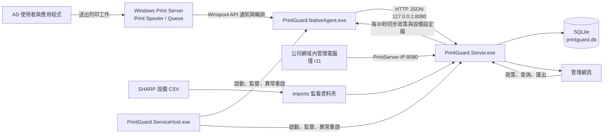

# PrintGuard 系統架構與程式碼責任說明

文件版本：2026-07-22（對應 r10／r11備份版與 v0.12.1 單一安裝程式）

## 1. 系統目的與目前範圍

PrintGuard 是安裝在 Windows Print Server 上的列印治理系統，主要提供：

- 自動發現 Print Server 看得到的所有列印佇列。
- 從 Windows Print Spooler 收集使用者、文件、印表機、頁數、份數、色彩與雙面資訊。
- 將成功、進行中與遭政策阻擋的工作寫入 SQLite。
- 依使用者、日期、月份、印表機及資料來源查詢與匯出 CSV；可切換使用者彙總、使用者／印表機明細及印表機彙總。
- 匯入 SHARP 設備工作 CSV，並以指紋排除重複資料。
- 從網頁設定印表機政策及設備判讀設定檔。
- 由真正的 Windows Service 在開機後自動啟動 Server 與 Native Agent。

目前保留兩個功能相同、網路開放方式不同的評估安裝包：

- `PrintGuard-Windows-Service-Installer-20260722-r10.zip`：本機限定版，只監聽 `127.0.0.1:8080`。
- `PrintGuard-Windows-Service-LAN-Installer-20260722-r11.zip`：公司 Domain LAN版，監聽 `0.0.0.0:8080`，並只在 Windows Domain Profile 放行 TCP 8080。

安裝ZIP不提交到Git；內部備份位置、SHA-256及版本切換方式記錄於 [RELEASES.md](RELEASES.md)，對外發佈應使用GitHub Release Assets。

## 2. 整體架構



兩個版本都只建立一個 Windows 服務 `PrintGuard`。該服務的宿主程式再監督兩個子程序：

1. `PrintGuard.Server.exe`：網頁、API、資料庫、報表及 CSV 匯入。
2. `PrintGuard.NativeAgent.exe`：Windows 列印佇列監控與政策執行。

## 3. 列印資料是如何取得的

### 3.1 資料來源

正式版使用 Windows 的 `winspool.drv` 原生 Print Spooler API，不使用網路封包側錄，也不讀取列印文件內容。主要呼叫如下：

| Windows API | 用途 |
|---|---|
| `EnumPrinters` | 列出本機 Print Server 可見的本機及連線佇列 |
| `OpenPrinter` / `ClosePrinter` | 開啟及關閉印表機佇列控制代碼 |
| `GetPrinter` | 取得驅動程式、連接埠及預設 DEVMODE |
| `DeviceCapabilities` | 判斷驅動程式宣告的彩色與雙面能力 |
| `FindFirstPrinterChangeNotification` / `FindNextPrinterChangeNotification` | 接收佇列工作變化通知 |
| `EnumJobs`（Level 2） | 讀取目前工作與 `JOB_INFO_2` 資料 |
| `SetJob(...JOB_CONTROL_DELETE)` | 刪除不符合測試政策的工作 |

### 3.2 欄位來源

| PrintGuard 欄位 | Windows 來源 |
|---|---|
| AD 使用者 | `JOB_INFO_2.pUserName`；是 Spooler 記錄的提交者，不是 PrintGuard 主動查詢 AD |
| 文件名稱 | `JOB_INFO_2.pDocument` |
| 用戶端電腦 | `JOB_INFO_2.pMachineName` |
| 印表機／佇列 | Agent 正在監控的 Queue 名稱 |
| 頁數 | `JOB_INFO_2.TotalPages`，工作處理期間可能逐步增加 |
| 份數 | 工作 DEVMODE 的 `dmCopies` |
| 彩色／黑白 | DEVMODE 的 `dmColor`，並受設備設定檔的信任規則修正 |
| 單面／雙面 | DEVMODE 的 `dmDuplex`，並受設備設定檔的信任規則修正 |
| 驅動與資料型態 | `pDriverName`、`pDatatype` |
| 工作大小與狀態 | `Size`、`Status` |

因此，在 Print Server 上執行 Agent 時，可以看到所有經過該伺服器佇列的使用者工作，而不只目前登入 Server 的管理者。這是 Print Server 本身的佇列管理權限所提供的資訊，不是跨電腦竊聽。

### 3.3 事件取得策略

Agent 同時採用兩種方式，降低短時間工作漏抓的機率：

- 事件通知：Spooler 有工作變化時立即通知。
- 每 500 毫秒輪詢：補捉通知間隔內的工作狀態與頁數變化。

相同工作以「主機＋佇列＋Job ID＋提交時間」形成工作鍵。Agent 只在頁數、份數、色彩或雙面狀態改變時更新 API；工作從佇列消失超過2秒後標記完成，並保留5分鐘防止同一工作被重複建立。

## 4. 政策管控邏輯

### 4.1 政策種類

- `any`：不限制彩色或黑白。
- `mono`：要求工作必須是黑白。
- `color`：要求工作必須是彩色。

管理者在網頁修改政策後，Server 寫入 `printers.policy`。Native Agent 每30秒同步設備、政策及設備設定檔。

### 4.2 目前真正的執行方式

目前 Native Agent 的強制執行方式是「阻擋不符合的工作」：

- `mono` 佇列收到彩色工作：刪除工作。
- `color` 佇列收到黑白工作：刪除工作。
- 符合政策：正常列印。
- 無法可靠判斷色彩：記錄為未知，不任意阻擋。

目前不會將彩色工作自動改寫成黑白，也不會將黑白工作轉成彩色。改寫工作需要更深入的 Print Processor、驅動設定或分離佇列設計，不能只修改資料庫欄位達成。

### 4.3 安全護欄

為避免開發中的規則誤刪正式工作，目前只有 Queue 名稱包含 `_test` 時才允許 `JOB_CONTROL_DELETE`。正式 Queue 的網頁政策可以同步及稽核，但不會被 Agent 強制刪除。要開放正式佇列前，必須另行完成核准、備份及驗證。

被成功阻擋的工作保存在違規紀錄，但狀態是 `blocked`，不計入成功列印報表。

## 5. 設備設定檔與判讀

Agent 以驅動程式名稱、驅動版本、彩色能力及雙面能力組成 SHA-256 設備指紋。相同指紋共用一份 `device_profiles` 判讀設定，因此更換 Queue 名稱仍可沿用設定。

這也表示：兩台使用完全相同驅動版本與能力的設備，目前可能共用設定檔，即使實體連接埠不同。這是現行「依驅動能力重用」的設計；若未來要求每台實體設備完全獨立，指紋需再納入連接埠、伺服器或設備序號。

設定欄位：

- `color_mode`：自動判斷、固定黑白或固定彩色。
- `duplex_mode`：自動判斷、固定單面或固定雙面。
- `trust_color_standard`：信任標準 DEVMODE 彩色欄位。
- `trust_duplex_standard`：信任標準 DEVMODE 雙面欄位。
- `profile_status`：自動、已驗證、待檢查。

驅動程式若把真正設定放在廠商私有 DEVMODE 區塊，標準欄位可能不準確；此時必須使用實測結果調整設備設定檔。頁數是邏輯頁數，紙張張數則以 `ceil(頁數/2) × 份數` 推算雙面用紙，並非印表機硬體計數器。

## 6. Server、API 與資料庫流程

### 6.1 PrintGuard Server

Server 的監聽方式依安裝版本而異：r10只監聽 `127.0.0.1:8080`；r11監聽 `0.0.0.0:8080`，但安裝器只在 Windows 防火牆的 Domain Profile 放行 TCP 8080，讓公司網域網路內的管理電腦使用 Print Server IP 開啟網頁，Private／Public Profile 不放行。兩版的本機 Agent 都透過 `127.0.0.1:8080` 傳送資料。Server 負責：

- 提供 HTML、CSS、JavaScript。
- 接收 Native Agent 的設備同步、工作新增、工作更新與完成通知。
- 保存政策、設備設定檔、工作及稽核紀錄。
- 產生日報、月報及 CSV。
- 匯入 SHARP 設備 CSV。
- 每日產生 Server Log，並清除超過30天的 Log。

### 6.2 主要 API

| API | 責任 |
|---|---|
| `GET /api/dashboard` | 設備、最新5筆工作及總覽數字 |
| `GET /api/violations` | 最新50筆被阻擋工作 |
| `GET /api/reports/usage` | 日／月報表查詢 |
| `GET /api/reports/export.csv` | 匯出目前條件的 CSV |
| `GET /api/device-imports` | 最近20次設備 CSV 匯入批次；前端只顯示3次 |
| `PATCH /api/printers/{id}` | 修改 `any`／`mono`／`color` 政策 |
| `POST /api/device-profiles/{printerId}` | 修改色彩、雙面判讀設定 |
| `POST /api/printers/sync` | Agent 同步 Queue 與能力，Server 回傳政策及設定檔 |
| `POST /api/jobs/native` | 建立或更新 Spooler 工作 |
| `POST /api/jobs/native/complete` | 將未阻擋工作標記完成 |
| `POST /api/device-imports` | 從網頁手動上傳設備 CSV |

### 6.3 SQLite 資料表

資料庫位置：`C:\ProgramData\PrintGuard\data\printguard.db`

| 資料表 | 保存內容 |
|---|---|
| `printers` | Queue 名稱、驅動、連接埠、在線狀態、政策、設備指紋 |
| `jobs` | PrintGuard 從 Spooler 收到的工作、使用者、頁數、色彩、雙面、狀態 |
| `audit` | 政策修改與系統操作稽核 |
| `device_profiles` | 可重用的驅動／設備判讀設定 |
| `device_import_batches` | 每次 CSV 匯入的檔名、SHA-256、新增／重複／錯誤筆數 |
| `device_import_jobs` | 設備 CSV 的逐筆列印工作 |

總覽的「今日完成工作、今日列印頁數、今日政策攔截」依台北時區的當日 00:00～隔日 00:00 統計，只計算 PrintGuard 的 `jobs`，不包含設備 CSV 匯入。報表頁可選 PrintGuard、設備匯入或兩者並列，統計方式包含：

- 使用者彙總（預設）：跨所有印表機合併同一位使用者，附使用印表機數。
- 使用者／印表機明細：同一使用者依印表機分列。
- 印表機彙總：依印表機合計，附使用人數。

CSV 提供使用者彙總與使用者／印表機明細兩種匯出。PrintGuard 的印表機顯示 Queue 名稱，設備匯入顯示「型號（序號）」，不建立或顯示辦公室欄位。

## 7. 設備 CSV 匯入與保存

自動匯入資料夾：`C:\ProgramData\PrintGuard\imports`

Server 啟動時及每60秒掃描一次根目錄下的 `.csv`。為避免讀到仍在複製的檔案，修改時間未滿5秒的檔案會留到下次掃描。

- 支援 UTF-8 BOM 與 Big5／CP950 的 SHARP 工作明細。
- 單檔上限25 MB。
- 檔案層以 SHA-256 判斷是否整檔重複。
- 工作層以設備序號、工作 ID、帳戶工作 ID、時間及工作模式形成指紋。
- 成功或已去重：移至 `imports\processed`。
- 格式錯誤或匯入失敗：移至 `imports\failed`。
- `processed` 與 `failed` 都保留30天，逾期自動刪除。
- 原始 CSV 被刪除不會刪除資料庫內已匯入的工作。
- 設備報表只統計 `result=OK`；錯誤工作保留供稽核但不計成功用量。

## 8. Windows Service 與安裝目錄

Windows 服務：

- Service Name：`PrintGuard`
- Display Name：`PrintGuard 列印治理服務`
- 執行帳戶：`LocalSystem`
- 啟動方式：Automatic／延遲自動（依 Windows 接受結果）
- 相依服務：Windows Print Spooler
- 異常復原：由 SCM 及 Service Host 重新啟動

正式安裝路徑：

```text
C:\ProgramData\PrintGuard
├─ bin
│  ├─ PrintGuard.ServiceHost.exe
│  ├─ PrintGuard.Server.exe
│  └─ PrintGuard.NativeAgent.exe
├─ data
│  └─ printguard.db
├─ imports
│  ├─ processed
│  └─ failed
├─ logs
│  ├─ agent
│  └─ service
└─ scripts
```

Service Host 若發現 Server 或 Agent 意外離開，會等待5秒後重新啟動。安裝升級只替換 `bin` 與管理腳本，不刪除 `data`、`logs` 或 `imports`。

## 9. 原始碼與每個檔案的責任

### 9.1 正式核心程式

| 路徑 | 責任 |
|---|---|
| `server.py` | HTTP Server、API、SQLite schema／migration、政策保存、工作彙整、報表、CSV 匯入與保存期限 |
| `native-agent/Program.cs` | Agent 主迴圈、Queue 發現、通知＋輪詢、去重、API 傳送、政策同步、阻擋、JSONL Log |
| `native-agent/NativeMethods.cs` | `winspool.drv`／`kernel32.dll` P/Invoke 宣告、Windows 結構與常數 |
| `native-agent/PrintGuard.NativeAgent.csproj` | Native Agent 的 .NET 專案與發佈設定 |
| `service-host/Program.cs` | Windows Service 入口、服務狀態回報、Server／Agent 監督及停止 |
| `service-host/PrintGuard.ServiceHost.csproj` | Service Host 的 .NET 專案與發佈設定 |

### 9.2 Server 內主要函式

| 函式／類別 | 責任 |
|---|---|
| `arg_value` | 讀取 `--name=value` 啟動參數 |
| `connect` | SQLite 連線、交易提交與錯誤回復 |
| `init_db` | 建立資料表、索引及舊資料庫輕量升級 |
| `evaluate` | 模擬器使用的基本政策判斷；正式阻擋由 Native Agent 執行 |
| `usage_export` | PrintGuard 成功工作日／月彙總 |
| `import_device_csv` | 解碼、驗證、解析、逐筆去重並寫入 SHARP CSV |
| `_archive_import` | 將處理後檔案移至成功或失敗資料夾 |
| `cleanup_device_imports` | 清除成功與失敗資料夾中超過30天的檔案 |
| `scan_device_imports` | 每分鐘掃描、匯入、分類檔案 |
| `device_usage_export` | 設備 CSV 成功工作彙總 |
| `report_by_source` | 選擇 PrintGuard、設備匯入或合併報表 |
| `sync_devices` | Queue upsert、設備指紋與設定檔重用、回傳政策 |
| `API` | HTTP GET／POST／PATCH、JSON／CSV 回應及靜態網頁 |
| `main` | 啟動清理、資料庫、CSV watcher 與 HTTP Server |

### 9.3 網頁

| 路徑 | 責任 |
|---|---|
| `web/index.html` | 基礎頁面骨架、總覽、設備、工作、報表及違規表格 |
| `web/app.js` | 呼叫 API、畫面渲染、政策／設定檔修改、查詢、匯出、匯入及側邊分頁 |
| `web/styles.css` | 版面、側邊欄、卡片、表格、狀態及響應式樣式 |

### 9.4 部署與管理

| 路徑 | 責任 |
|---|---|
| `deployment-service/Install-PrintGuard-Service.cmd` | 提升權限並呼叫 PowerShell 安裝器 |
| `deployment-service/Install-PrintGuard-Service.ps1` | 停止／升級舊服務、保留資料、複製程式、建立服務、設定復原並驗證 API |
| `deployment-service/Status-PrintGuard-Service.ps1` | 查看服務、子程序及 Dashboard 狀態 |
| `deployment-service/Uninstall-PrintGuard-Service.ps1` | 移除服務；預設保留資料 |
| `RELEASES.md` | r10／r11檔名、SHA-256、內部備份位置與版本切換方式 |
| `installer/PrintGuard.iss` | 單一 EXE 安裝、升級、服務／防火牆建立及完整解除安裝規則 |
| `installer/Build-Installer.ps1` | 重建 Server、Agent、Service Host 並編譯安裝程式 |
| `installer/Test-Installer-Uninstall.ps1` | 驗證檔案安裝、測試資料庫建立與完整移除 |
| `INSTALLATION_AND_UNINSTALL_GUIDE.md` | 管理者安裝、升級、備份、登入與解除安裝手冊 |

### 9.5 網頁登入與狀態顯示

| 檔案 | 責任 |
|---|---|
| `web/login.html`、`web/login.js` | 管理者登入頁面及登入請求 |
| `web/auth-ui.js` | 登出、工作階段失效及受保護頁面共用邏輯 |
| `web/auth.css` | 登入畫面樣式 |
| `web/status.css` | 印表機真實 Queue 狀態視覺提示 |
| `GITHUB_PUBLISHING.md` | GitHub可提交／不可提交資料及發佈前檢查 |

### 9.6 測試、診斷與舊版

| 路徑 | 狀態與用途 |
|---|---|
| `tests/test_native_api.py` | API、工作完成、政策排除報表、設備設定檔與 CSV 去重測試 |
| `tests/test_policy.py` | 基本政策函式單元測試 |
| `native-agent/Compare-Devmode.ps1` | 比較不同列印設定的 DEVMODE 診斷資料 |
| 私人備份的 `agent/` | 早期 PowerShell／Event 307 POC，r10／r11正式服務版不使用 |
| 私人備份的 `deployment*`／`service/` | 早期工作排程器安裝方式，r10／r11正式服務版不使用 |
| 私人備份的 `build/`／`dist/` | 編譯中間檔、安裝包、回復封裝及真實測試資料，不提交GitHub |

## 10. Log 與稽核位置

- Agent：`logs\agent\PrintGuard-Audit-主機名-YYYYMMDD.jsonl`
- Server：`logs\server-YYYYMMDD.log`
- Service Host：`logs\service\service-YYYYMMDD.log`

Agent 採每日一個 append-only JSONL，不再為每個工作建立獨立 BIN／TXT。首次 captured 記錄可內嵌廠商私有 DEVMODE Base64 與 SHA-256 供診斷。Agent 與 Server Log 預設保存30天。

Log 可能包含 AD 使用者、文件名稱、用戶端電腦及列印設定，應限制 `C:\ProgramData\PrintGuard` ACL，並依公司個資與稽核政策管理。離線稽核工具可使用 `--redact-documents` 隱藏文件名稱。

## 11. 資安邊界

- 不側錄 SMB、RAW 9100、LPR 或其他網路封包。
- 不讀取或保存文件實際內容。
- 不直接連線 AD；使用者名稱由 Spooler 工作提供。
- Agent 以 LocalSystem 執行，因此可見範圍等同該 Print Server 上的 Queue 管理範圍。
- r10 Dashboard 只能在 Print Server 本機使用；r11可從 Windows Domain 網路使用 Print Server IP 的 TCP 8080 連線，Private／Public Profile 仍由防火牆阻擋。
- 網頁使用單一管理員帳號與 Session Cookie 驗證；目前仍沒有 HTTPS 或角色分級，因此不得將8080透過 NAT、路由器或邊界防火牆直接公開到 Internet，並應限制在受信任公司網路使用。
- 政策強制目前只允許 `_test` Queue，避免未驗證規則影響正式列印。

## 12. 維運檢查清單

1. `services.msc` 確認 `PrintGuard 列印治理服務` 為執行中。
2. 確認 `http://127.0.0.1:8080` 可開啟。
3. 確認工作管理員可看到 Service Host、Server、Native Agent。
4. 以測試 Queue 各印黑白／彩色、單面／雙面並核對報表。
5. 定期備份 `data\printguard.db`；備份前最好短暫停止服務或使用 SQLite 一致性備份方式。
6. 檢查 `logs`、`imports\processed`、`imports\failed` 的30天清理是否正常。
7. 正式開放政策阻擋前，先在 `_test` Queue 完成驅動及設備設定檔驗證。

## 13. 管理員認證架構

1. 未登入瀏覽 `/` 時，Server 只提供獨立的 `login.html`。
2. 首次使用透過 `POST /api/auth/setup` 建立唯一管理員。
3. 密碼以 PBKDF2-HMAC-SHA256、隨機 Salt 與310,000次迭代保存，不儲存明碼。
4. 登入後取得 `HttpOnly`、`SameSite=Strict`、有效期8小時的 Cookie。
5. 資料查詢、報表、CSV匯入、政策修改及稽核 API 都需要有效 Session。
6. Native Agent 同步及工作回報 API 維持服務對服務連線，避免中斷 Print Server 收集。
7. `/api/health` 只回傳健康狀態，不包含印表機、使用者或文件資料。

認證資料位於 SQLite 的 `admin_users` 與 `admin_sessions`。修改帳密會撤銷既有 Session。

## 14. 印表機狀態判讀

Native Agent 使用 Winspool `GetPrinter(Level 2)` 讀取 `PRINTER_INFO_2.Status` 與 `Attributes`：

- `online`：Windows 回報就緒，或只有列印／處理中等正常狀態。
- `warning`：缺紙、卡紙、碳粉、門開啟或需要人員介入。
- `offline`：離線、無法使用、Print Server 未知或 `WORK_OFFLINE`。

Server 將狀態、說明及原始旗標保存於 `printers`，Dashboard 以綠／黃／紅燈呈現。各廠牌驅動程式回報能力不同，仍需與 Windows Print Management 實機對照。

## 15. 單檔安裝程式架構

`installer/PrintGuard.iss` 使用 Inno Setup 產生單一 `PrintGuard-Setup.exe`。內含 Server、Native Agent、Service Host 與操作文件。

安裝時取得系統管理員權限，停止舊服務但保留資料，更新執行檔，重建相依於 Spooler 的自動延遲啟動服務、失敗復原規則與 Domain TCP 8080 防火牆規則。升級不執行資料刪除。

從 Windows 已安裝應用程式解除安裝時，會先警告資料永久刪除，再移除服務、防火牆規則及整個 `C:\ProgramData\PrintGuard`，包含資料庫、Log 與匯入檔。

`installer/Build-Installer.ps1` 負責重建三個自包含 EXE、整理文件並呼叫 Inno Setup Compiler。輸出位於 Git 忽略的 `build/setup-exe`，二進位檔不提交到原始碼分支。

## 16. 已知限制與後續方向

- Spooler 工作存在時間很短，雖已使用通知加輪詢，仍應持續和設備硬體計數或 PaperCut 抽樣比對。
- 廠商驅動的私有 DEVMODE 可能造成標準色彩／雙面欄位不準。
- 目前設備指紋沒有實體序號或連接埠，同驅動設備可能共用設定檔。
- 目前強制政策是阻擋，不是自動改寫列印內容。
- 設備 CSV 目前以 SHARP 欄位格式為主；其他品牌需要各自的解析器，但可共用匯入、去重與報表架構。
- Dashboard 已提供單一管理員登入，但尚未提供角色分級、AD整合與遠端 HTTPS。
- 資料庫工作紀錄目前沒有自動保留期限；只有 Log 與匯入原始檔是30天。
